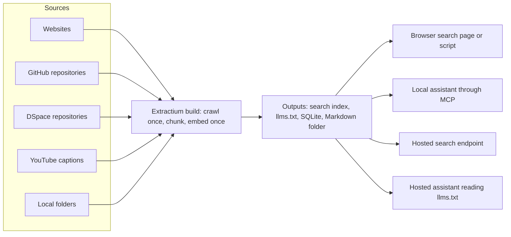

<!--
This file is part of Extractium™
README.md
Author(s): Gabriel Mongefranco
Created: 2026-08-16
Last Modified: 2026-09-12
Summary: Provides an overview of the project, in Markdown format.
Notes: See README file for documentation and full license information.

Copyright © 2026 The Regents of the University of Michigan

This program is free software: you can redistribute it and/or modify
it under the terms of the GNU General Public License as published by
the Free Software Foundation, either version 3 of the License, or (at your option) any later version.
This program is distributed in the hope that it will be useful,
but WITHOUT ANY WARRANTY; without even the implied warranty of
MERCHANTABILITY or FITNESS FOR A PARTICULAR PURPOSE. See the
GNU General Public License for more details.
You should have received a copy of the GNU General Public License along
with this program. If not, see <https://www.gnu.org/licenses/>.

-->


# Extractium™

## Description
Extractium™ turns scattered public documentation into one searchable knowledge base. Point it at sources such as TeamDynamix, GitHub, YouTube, a DSpace repository, websites, and local files, and it gathers and organizes the content for use in a website, search tool, or AI assistant.

Behind the scenes, Extractium™ prepares the content for both keyword and semantic search and publishes several output formats for static hosting, including GitHub Pages. It grew out of the indexing engine in Field Station AI™ and uses configuration and plugins so research centers and other organizations can build their own knowledge collections.

Project status: every planned part is built. Five source types (websites, GitHub repositories with code analysis, DSpace repositories, YouTube captions, and local folders) feed one build, which writes four outputs (the search index, the `llms.txt` pair, a SQLite database, and a folder of Markdown). Two clients search the index, two local servers offer that search to an AI assistant on your machine, two hosted examples offer it to an assistant anywhere, and two system prompts point a browsing assistant at the published files.



In words: five kinds of source feed one build, which crawls and embeds each piece of content once and then writes the same result in four formats. Those files are consumed in four ways. A browser page or a script searches the index directly. An assistant on your own machine searches it through a local Model Context Protocol (MCP) server. An assistant anywhere calls a hosted search endpoint on Val Town or Cloudflare. A platform that can browse but cannot call tools reads `llms.txt` from a system prompt.


## Quick Start Guide
There are two ways in. The one-command script installs and builds in one step:

```bash
git clone https://github.com/DepressionCenter/extractium.git
cd extractium
cp examples/config.example.yaml config.yaml   # then change the seed URL to your own site
./run.sh --max-pages 25                        # run.bat on Windows
```

A developer installs it into a virtual environment instead, then builds:

```bash
pip install -e ".[dev,code,youtube]"
python -m extractium.cli build --config config.yaml --max-pages 25
```

Needs Python 3.10 or newer. The first build downloads the embedding model, about 130 MB; later builds reuse it. The three extras are optional: `dev` adds the test tools, `code` adds the parsers that read a repository's code, and `youtube` adds the caption library. Two environment variables are optional too and are never read from a settings file: `GITHUB_TOKEN` raises the GitHub request limit, and `YOUTUBE_API_KEY` lets a build list a whole channel.

That writes `dist/compendium.json`, `dist/llms.txt`, and `dist/llms-full.txt`. Drop the page cap once the page list in `dist/llms.txt` looks right. See [how to install](docs/how-to/install.md) for the extras and the lock file, [how to crawl a site](docs/how-to/crawl-a-site.md) for your first real build, and [docs/troubleshooting.md](docs/troubleshooting.md) if a step above did not work.


## Documentation
+ The full documentation is available at: https://michmed.org/efdc-kb
+ Technical pages live in [docs/](docs/README.md):
  + [How to install](docs/how-to/install.md) — the two ways in, the optional extras, and the lock file.
  + [How to crawl a site](docs/how-to/crawl-a-site.md) — choosing source types, the trial run, tuning patterns, and reading what a build reports.
  + [Running a build](docs/usage.md) — the command line, its options, and its exit codes.
  + [Configuration reference](docs/configuration.md) — every setting in `config.yaml`.
  + [Troubleshooting](docs/troubleshooting.md) — known failures, causes, and fixes.
  + [How to deploy](docs/how-to/deploy.md) — the deployment choices side by side, and every way the outputs are consumed.
  + [How to run a weekly build](docs/how-to/run-a-weekly-build.md) — the one-command local build and the scheduled one.
  + [How to publish to GitHub Pages](docs/how-to/publish-to-github-pages.md) — turning Pages on and what publishing means.
  + [How to search a compendium](docs/how-to/search-a-compendium.md) — searching a built index from Python or JavaScript.
  + [How to connect an MCP client](docs/how-to/connect-an-mcp-client.md) — letting an AI assistant on your own machine search a published index.
  + [How to deploy a remote MCP server](docs/how-to/deploy-a-remote-mcp-server.md) — hosting that search on Val Town or Cloudflare for an assistant anywhere.
  + [Using a published compendium](docs/using-a-compendium.md) — how an AI agent should use the published files.
  + [Architecture and current state](docs/architecture.md) — what each module does and the settled design decisions.
  + [Plugin architecture](docs/plugin-architecture.md) — the three plugin kinds, the registry, and a working example of each.
  + [Data flow](docs/data-flow.md) — what happens to content between the site and the output folder.
  + [Container format](docs/container-format.md) — the index file every client reads.
  + [Compliance and posture](docs/compliance.md) — the controls in place, the evidence, and the known gaps.
  + [Specification](docs/extractium-spec.md) — the intended design: architecture, plugin kinds, outputs, and sources.
  + [GitHub repository indexing](docs/github-repository-indexing.md) — the design of the GitHub source and the code analysis.
  + [Indexing a DSpace repository](docs/dspace-repository-indexing.md) — the design of the repository source.
  + [Reading a site behind bot protection](docs/bot-protection-transport.md) — what was measured and how the build reads such a site.
  + [Implementation plan](docs/implementation-plan.md) — the phased order in which the tool was built.


## Additional Resources
+ FieldStationAI™: https://github.com/DepressionCenter/FieldStationAI
+ [Mobile Technologies Core](https://depressioncenter.org/mobiletech) — the group that develops and maintains Field Station AI.
+ [EFDC Knowledge Base](https://michmed.org/efdc-kb) — documentation site referenced above and used as source content for the app's optional knowledge-base feature.


## About the Team
The [Mobile Technologies Core](https://depressioncenter.org/mobiletech) provides investigators across the University of Michigan the support and guidance needed to utilize mobile technologies and digital mental health measures in their studies. Experienced faculty and staff offer hands-on consultative services to researchers throughout the University – regardless of specialty or research focus.

Learn more at: [https://depressioncenter.org/mobiletech](https://depressioncenter.org/mobiletech).


## Contact
To get in touch, contact the individual developers in the check-in history.

If you need assistance identifying a contact person, email the EFDC's Mobile Technologies Core at: efdc-mobiletech@umich.edu.


## Credits
### Authors:
+ [Gabriel Mongefranco](https://gabriel.mongefranco.com) [(@gabrielmongefranco)](https://github.com/gabrielmongefranco)


### Contributors:
+ [Eisenberg Family Depression Center](https://depressioncenter.org) [(@DepressionCenter)](https://github.com/DepressionCenter)


### This work is based in part on the following projects, libraries and/or studies:
+ FieldStationAI™ : A research platform for mobile and digital mental health studies. Used as the original source of the crawling/indexing engine that was extracted into this project. https://github.com/DepressionCenter/FieldStationAI
+ BAAI/bge-small-en-v1.5 : The sentence-embedding model every build and every client use, so that a question and a passage land in the same vector space. MIT license. https://huggingface.co/BAAI/bge-small-en-v1.5
+ llms.txt : The convention the `llms.txt` and `llms-full.txt` outputs follow, for language models that browse the web. https://llmstxt.org/
+ Open Knowledge Format : The Markdown-with-front-matter format the `okf` output writes, one file per page. https://github.com/GoogleCloudPlatform/open-knowledge-format

Runtime dependencies, installed with the package:
+ requests : HTTP client. Fetches every page, repository file, and caption listing. Apache-2.0 license. https://requests.readthedocs.io/
+ curl_cffi : HTTP client with a browser-shaped TLS handshake. Used only when a site answers a bot-protection challenge, with the crawler still naming itself. MIT license; bundles its own build of libcurl. https://github.com/lexiforest/curl_cffi
+ Beautiful Soup 4 : HTML parser. Reads each fetched page so the site handlers can find its title and content. MIT license. https://www.crummy.com/software/BeautifulSoup/
+ Sentence Transformers : Runs the embedding model over every window once per build. Apache-2.0 license. https://sbert.net/
+ NumPy : Array arithmetic for the vectors, the near-duplicate collapse, and the calibration statistics. BSD-3-Clause license, with bundled components under 0BSD, MIT, Zlib, and CC0-1.0. https://numpy.org/
+ Python-Markdown : Renders Markdown files from a local folder or a repository into HTML before chunking. BSD-3-Clause license. https://python-markdown.github.io/
+ PyYAML : Reads the settings file and writes the front matter of the Open Knowledge Format output. MIT license. https://pyyaml.org/

Optional dependencies, installed with an extra or by hand:
+ Tree-sitter and thirteen language grammars (`code` extra) : Parse a repository's source files so a search can find a definition and what calls it, never copying a source body. MIT license, each. https://tree-sitter.github.io/tree-sitter/
+ Universal Ctags (installed on the machine, not with pip) : Reads the languages no grammar covers, when present. Run with an argument array, no shell, and no configuration file. GPL-2.0-or-later license. https://ctags.io/
+ youtube-transcript-api (`youtube` extra) : Fetches a video's caption track. MIT license. https://github.com/jdepoix/youtube-transcript-api

Development dependencies (`dev` extra and the lock file):
+ pytest and pytest-cov : Run the test suite and measure its coverage. MIT license, each. https://docs.pytest.org/
+ uv : Generates the hash-checked lock file the run scripts and the scheduled build install from. Apache-2.0 or MIT license. https://docs.astral.sh/uv/

Used by the examples only:
+ @huggingface/transformers and the ONNX Runtime it brings : Run the same embedding model in the Node search server. Apache-2.0 and MIT licenses respectively. https://huggingface.co/docs/transformers.js

Every license above was read from the package's own metadata or license file, and each is compatible with the GNU General Public License v3.0 or later that this project carries.


## License
### Copyright Notice
Copyright © 2026 The Regents of the University of Michigan


### Software and Library License Notice
This program is free software: you can redistribute it and/or modify it under the terms of the GNU General Public License as published by the Free Software Foundation, either version 3 of the License, or (at your option) any later version.

This program is distributed in the hope that it will be useful, but WITHOUT ANY WARRANTY; without even the implied warranty of MERCHANTABILITY or FITNESS FOR A PARTICULAR PURPOSE. See the GNU General Public License for more details.

You should have received a copy of the GNU General Public License along with this program. If not, see <https://www.gnu.org/licenses/gpl-3.0-standalone.html>.


### Documentation License Notice
Permission is granted to copy, distribute and/or modify this document 
under the terms of the GNU Free Documentation License, Version 1.3 
or any later version published by the Free Software Foundation; 
with no Invariant Sections, no Front-Cover Texts, and no Back-Cover Texts. 
You should have received a copy of the license included in the section entitled "GNU 
Free Documentation License". If not, see <https://www.gnu.org/licenses/fdl-1.3-standalone.html>


## Citation
If you find this repository, code or paper useful for your research, please cite it.

#### Citation Example:
>_Mongefranco, Gabriel (2026). Extractium™. University of Michigan. Software. https://github.com/DepressionCenter/extractium_  
​​​​​​​     _DOI: [< DOI # e.g. 10.6084/m9.figshare.xxxxxx.v1 >](https://doi.org/...)_


----

Copyright © 2026 The Regents of the University of Michigan
