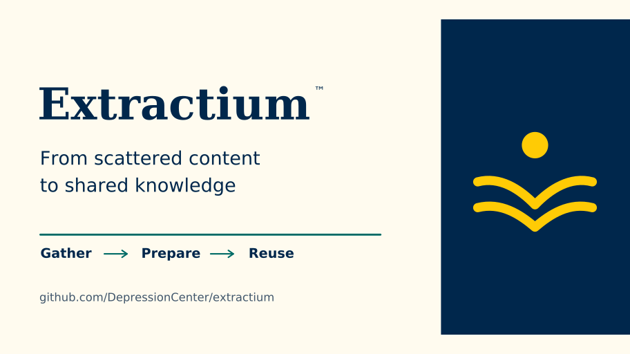

<!--
This file is part of Extractium™
README.md
Author(s): Gabriel Mongefranco
Created: 2026-08-16
Last Modified: 2026-09-04
Summary: Provides an overview of the project, in Markdown format.
Notes: See README file for documentation and full license information.

Copyright © 2026 The Regents of the University of Michigan

This program is free software: you can redistribute it and/or modify
it under the terms of the GNU General Public License as published by
the Free Software Foundation, either version 3 of the License, or (at your option) any later version.
This program is distributed in the hope that it will be useful,
but WITHOUT ANY WARRANTY; without even the implied warranty of
MERCHANTABILITY or FITNESS FOR A PARTICULAR PURPOSE. See the
GNU General Public License for more details.
You should have received a copy of the GNU General Public License along
with this program. If not, see <https://www.gnu.org/licenses/>.

-->


# Extractium™

## Description
Extractium™ turns scattered public documentation into one searchable knowledge base. Point it at sources such as TeamDynamix, GitHub, YouTube, websites, and local files, and it gathers and organizes the content for use in a website, search tool, or AI assistant.
<!--  -->

Behind the scenes, Extractium™ prepares the content for both keyword and semantic search and can publish multiple output formats for static hosting, including GitHub Pages. It grew out of the indexing engine in Field Station AI™ and uses configuration and plugins so research centers and other organizations can build their own knowledge collections.

Project status: this repository is currently at the package-skeleton stage, and the command-line interface is not yet functional. See the implementation plan in `docs/` for the order of work.


## Quick Start Guide
```bash
pip install -e ".[dev]"
```
The `extractium` command is not yet functional (package-skeleton stage — see [docs/implementation-plan.md](docs/implementation-plan.md) for the order of work).


## Documentation
+ The full documentation is available at: https://michmed.org/efdc-kb
+ Technical pages live in [docs/](docs/README.md):
  + [Configuration reference](docs/configuration.md) — every setting in `config.yaml`.
  + [Specification](docs/extractium-spec.md) — architecture, plugin kinds, outputs, and sources.
  + [Container format](docs/container-format.md) — the index file every client reads.
  + [Implementation plan](docs/implementation-plan.md) — the phased order of work.


## Additional Resources
+ FieldStationAI™: https://github.com/DepressionCenter/FieldStationAI
+ [Mobile Technologies Core](https://depressioncenter.org/mobiletech) — the group that develops and maintains Field Station AI.
+ [EFDC Knowledge Base](https://michmed.org/efdc-kb) — documentation site referenced above and used as source content for the app's optional knowledge-base feature.


## About the Team
The [Mobile Technologies Core](https://depressioncenter.org/mobiletech) provides investigators across the University of Michigan the support and guidance needed to utilize mobile technologies and digital mental health measures in their studies. Experienced faculty and staff offer hands-on consultative services to researchers throughout the University – regardless of specialty or research focus.

Learn more at: [https://depressioncenter.org/mobiletech](https://depressioncenter.org/mobiletech).


## Contact
To get in touch, contact the individual developers in the check-in history.

If you need assistance identifying a contact person, email the EFDC's Mobile Technologies Core at: efdc-mobiletech@umich.edu.


## Credits
### Authors:
+ [Gabriel Mongefranco](https://gabriel.mongefranco.com) [(@gabrielmongefranco)](https://github.com/gabrielmongefranco)


### Contributors:
+ [Eisenberg Family Depression Center](https://depressioncenter.org) [(@DepressionCenter)](https://github.com/DepressionCenter)


### This work is based in part on the following projects, libraries and/or studies:
+ FieldStationAI™ : A research platform for mobile and digital mental health studies. Used as the original source of the crawling/indexing engine that was extracted into this project. https://github.com/DepressionCenter/FieldStationAI


## License
### Copyright Notice
Copyright © 2026 The Regents of the University of Michigan


### Software and Library License Notice
This program is free software: you can redistribute it and/or modify it under the terms of the GNU General Public License as published by the Free Software Foundation, either version 3 of the License, or (at your option) any later version.

This program is distributed in the hope that it will be useful, but WITHOUT ANY WARRANTY; without even the implied warranty of MERCHANTABILITY or FITNESS FOR A PARTICULAR PURPOSE. See the GNU General Public License for more details.

You should have received a copy of the GNU General Public License along with this program. If not, see <https://www.gnu.org/licenses/gpl-3.0-standalone.html>.


### Documentation License Notice
Permission is granted to copy, distribute and/or modify this document 
under the terms of the GNU Free Documentation License, Version 1.3 
or any later version published by the Free Software Foundation; 
with no Invariant Sections, no Front-Cover Texts, and no Back-Cover Texts. 
You should have received a copy of the license included in the section entitled "GNU 
Free Documentation License". If not, see <https://www.gnu.org/licenses/fdl-1.3-standalone.html>


## Citation
If you find this repository, code or paper useful for your research, please cite it.

#### Citation Example:
>_Mongefranco, Gabriel (2026). Extractium™. University of Michigan. Software. https://github.com/DepressionCenter/extractium_  
​​​​​​​     _DOI: [< DOI # e.g. 10.6084/m9.figshare.xxxxxx.v1 >](https://doi.org/...)_


----

Copyright © 2026 The Regents of the University of Michigan
