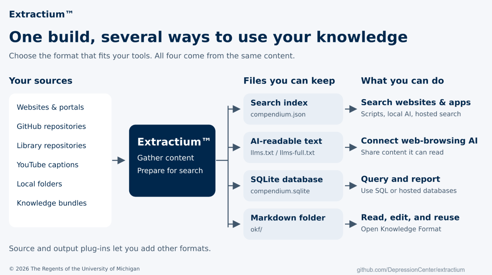

<!--
This file is part of Extractium™
README.md
Author(s): Gabriel Mongefranco
Created: 2026-08-16
Last Modified: 2026-09-15
Summary: Provides an overview of the project, in Markdown format.
Notes: See README file for documentation and full license information.

Copyright © 2026 The Regents of the University of Michigan

This program is free software: you can redistribute it and/or modify
it under the terms of the GNU General Public License as published by
the Free Software Foundation, either version 3 of the License, or (at your option) any later version.
This program is distributed in the hope that it will be useful,
but WITHOUT ANY WARRANTY; without even the implied warranty of
MERCHANTABILITY or FITNESS FOR A PARTICULAR PURPOSE. See the
GNU General Public License for more details.
You should have received a copy of the GNU General Public License along
with this program. If not, see <https://www.gnu.org/licenses/>.

-->


# Extractium™

## Description
Extractium™ turns your organization's scattered public documentation into one searchable knowledge base. Point it at your website, knowledge base portal, GitHub repositories, YouTube channel, library repository, or a folder of files, and it gathers the content, prepares it for both keyword and meaning-based search, and writes it out in several formats. You can then use that knowledge base in a website search box, in your own scripts, or with the AI assistant of your choice, without depending on any one AI provider.


Unlike a vector database, Extractium™ needs no server, no database, and no API to run. Every output is a static file that you can host anywhere, including GitHub Pages, and the same build feeds all of them at once. Sources and outputs are plug-ins, so you can add your own if the built-in ones do not cover your needs.



| Output | Files | Best for |
|---|---|---|
| Search index | `compendium.json` | Fast keyword and meaning-based search with nothing to run: a search box on your website, a script, an AI assistant on your computer, or a hosted search endpoint. |
| llms.txt files | `llms.txt`, `llms-full.txt` | AI assistants and platforms that can read web pages but cannot call tools. Also a readable list of everything that was indexed. |
| SQLite database | `compendium.sqlite` | SQL queries and reports, or loading the content into a hosted database. |
| Markdown folder | `okf/` | Reading and editing the content as ordinary files, sharing it with other tools that use the Open Knowledge Format, or feeding it into another Extractium™ build. |

Extractium™ grew out of the indexing engine in [Field Station AI™](https://github.com/DepressionCenter/FieldStationAI), which remains an [example front-end](https://code.depressioncenter.org/FieldStationAI) implementation for how to access the JSON output in JavaScript.

## Quick Start Guide
+ Install Python 3.10 or newer.
+ Save the build script for your operating system into an empty folder: [run.sh](https://raw.githubusercontent.com/DepressionCenter/extractium/main/run.sh) for macOS and Linux, or [run.bat](https://raw.githubusercontent.com/DepressionCenter/extractium/main/run.bat) for Windows. If you have git, you can clone this repository instead and run the script from the clone.
+ Run the script. It downloads the latest release of Extractium™ (with git if you have it, otherwise as a plain download), installs everything it needs into a virtual environment, asks you for the name of your knowledge base, a short name for its files, and the website to crawl, then builds a first index limited to 25 pages:

  ```bash
  ./run.sh       # macOS and Linux
  run.bat        # Windows
  ```

+ Open `dist/llms.txt` to see which pages were indexed. When the list looks right, run the script again to build the whole site. To change what is crawled, edit `config.yaml`. See `examples/config.efdc.yaml` for a complete example that uses every source type.
+ To use a Python development environment instead of the script, clone the repository, run `pip install -e ".[dev,code,youtube,pdf,keywords]"`, then `python -m extractium.cli init` to write `config.yaml` and `python -m extractium.cli build --config config.yaml` to build.

The first build downloads the embedding model, about 130 MB. Later builds reuse it.


## Documentation
+ An overview and user guide is available in the EFDC Knowledge Base at: https://michmed.org/efdc-kb
+ Detailed documentation, for users and developers, is available under [docs/](docs/README.md).


## Additional Resources
+ FieldStationAI™: https://github.com/DepressionCenter/FieldStationAI
+ [Mobile Technologies Core](https://depressioncenter.org/mobiletech), the group that develops and maintains Extractium™ and Field Station AI™.
+ [EFDC Knowledge Base](https://michmed.org/efdc-kb), the documentation site referenced above.


## About the Team
The [Mobile Technologies Core](https://depressioncenter.org/mobiletech) provides investigators across the University of Michigan the support and guidance needed to utilize mobile technologies and digital mental health measures in their studies. Experienced faculty and staff offer hands-on consultative services to researchers throughout the University – regardless of specialty or research focus.

Learn more at: [https://depressioncenter.org/mobiletech](https://depressioncenter.org/mobiletech).


## Contact
To get in touch, contact the individual developers in the check-in history.

If you need assistance identifying a contact person, email the EFDC's Mobile Technologies Core at: efdc-mobiletech@umich.edu.


## Credits
### Authors:
+ [Gabriel Mongefranco](https://gabriel.mongefranco.com) [(@gabrielmongefranco)](https://github.com/gabrielmongefranco)


### Contributors:
+ [Eisenberg Family Depression Center](https://depressioncenter.org) [(@DepressionCenter)](https://github.com/DepressionCenter)


### This work is based in part on the following projects, libraries and/or studies:
+ FieldStationAI™: A research platform for mobile and digital mental health studies. Its crawling and indexing engine was extracted into this project. https://github.com/DepressionCenter/FieldStationAI
+ BAAI/bge-small-en-v1.5: The sentence-embedding model used by every build and every client. MIT license. https://huggingface.co/BAAI/bge-small-en-v1.5
+ llms.txt: The convention the `llms.txt` and `llms-full.txt` outputs follow. https://llmstxt.org/
+ Open Knowledge Format: The Markdown-with-front-matter format the `okf` output writes and the `okf` source reads. https://github.com/GoogleCloudPlatform/open-knowledge-format
+ Python libraries used: requests, curl_cffi, Beautiful Soup 4, Sentence Transformers, NumPy, Python-Markdown, PyYAML, and optionally Tree-sitter with its language grammars, Universal Ctags, youtube-transcript-api, pypdf, pytest, and uv.
+ JavaScript libraries used by the examples: @huggingface/transformers and the ONNX Runtime it brings.

Every dependency license was checked for compatibility with the GNU General Public License v3.0 or later. The list, with each license, is in [docs/compliance.md](docs/compliance.md).


## License
### Copyright Notice
Copyright © 2026 The Regents of the University of Michigan


### Software and Library License Notice
This program is free software: you can redistribute it and/or modify it under the terms of the GNU General Public License as published by the Free Software Foundation, either version 3 of the License, or (at your option) any later version.

This program is distributed in the hope that it will be useful, but WITHOUT ANY WARRANTY; without even the implied warranty of MERCHANTABILITY or FITNESS FOR A PARTICULAR PURPOSE. See the GNU General Public License for more details.

You should have received a copy of the GNU General Public License along with this program. If not, see <https://www.gnu.org/licenses/gpl-3.0-standalone.html>.


### Documentation License Notice
Permission is granted to copy, distribute and/or modify this document 
under the terms of the GNU Free Documentation License, Version 1.3 
or any later version published by the Free Software Foundation; 
with no Invariant Sections, no Front-Cover Texts, and no Back-Cover Texts. 
You should have received a copy of the license included in the section entitled "GNU 
Free Documentation License". If not, see <https://www.gnu.org/licenses/fdl-1.3-standalone.html>


## Citation
If you find this repository, code or paper useful for your research, please cite it.

#### Citation Example:
>_Mongefranco, Gabriel (2026). Extractium™. University of Michigan. Software. https://github.com/DepressionCenter/extractium_  
​​​​​​​     _DOI: [10.5281/zenodo.22754640](https://doi.org/10.5281/zenodo.22754640)_


----

Copyright © 2026 The Regents of the University of Michigan
