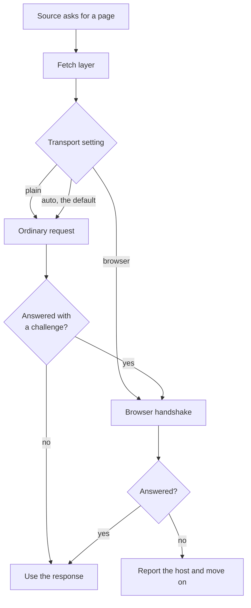

<!--
This file is part of Extractium™
docs/bot-protection-transport.md
Author(s): Gabriel Mongefranco
Created: 2026-09-10
Last Modified: 2026-09-12
Summary: Why some sites refuse the crawler with a bot-protection challenge,
what was measured against three live sites, and how the build reads them
without running a browser and without misidentifying the crawler.
Notes: See README file for documentation and full license information.

Copyright © 2026 The Regents of the University of Michigan

Licensed under the GNU Free Documentation License v1.3 or later.
See <https://www.gnu.org/licenses/fdl-1.3.html>. See README for full license information.

-->

# Extractium™

## Reading a Site Behind Bot Protection

[← Back to README](../README.md)


## Summary

Some websites refuse a crawler before it reads a single page. They answer `403 Forbidden` no matter what the crawler asks for. This page explains why that happens, what it turned out to be in the Depression Center's own case, and how Extractium is designed to read those sites.

It is written for whoever maintains the crawler, and for anyone who has to decide whether this approach is acceptable for their organization. The short version: the refusal is not about the crawler's name, and the fix is not a trick. It is about how the connection itself is opened.

The transport described under "The design" is built, and is on by default: a build needs no setting to read such a site. The `transport` setting in the [configuration reference](configuration.md) turns it off or forces it. The measurements below are real and dated, and the build was run against the same three sites on 2026-09-12 with the same result.


## The problem, as a person meets it

You point a build at your own organization's website and every page is refused:

```text
SKIP https://example.org/ -- refused with status 403
SKIP https://example.org/about -- refused with status 403
```

The response carries two clues:

```text
server: cloudflare
cf-mitigated: challenge
```

That second header means a bot-protection service stopped the request and asked the visitor to prove it is a browser. The proof normally involves running a small script. A crawler runs no scripts, so on the face of it there is nothing to be done.

That reading is wrong, and it cost real time to find out. What follows is what was actually measured.


## What was measured

Three Depression Center hosts, on 2026-09-10, from an ordinary internet connection.

### The `User-Agent` is not what is being read

The obvious first guess is that the service recognizes the crawler by name. It does not.

| Request | Result |
|---|---|
| Extractium's own `User-Agent` | `403`, `cf-mitigated: challenge` |
| A current Chrome `User-Agent`, everything else the same | `403`, `cf-mitigated: challenge` |

Both refused, and the response bodies differ only by the length of the string echoed back. Changing the name the crawler gives achieves nothing, which is worth knowing before anyone spends a day on it.

### Nor is it the headers, nor the HTTP version

| Client | Result |
|---|---|
| Python `requests`, Extractium headers | `403 challenge` |
| Python `requests`, full Chrome header set | `403 challenge` |
| `curl`, default | `403 challenge` (HTTP/2) |
| `curl --http2`, full Chrome header set including `sec-ch-ua` and `Sec-Fetch-*` | `403 challenge` |
| Windows `Invoke-WebRequest` (a different TLS library again) | `403 challenge` |

Five clients, three TLS libraries, two header sets. All refused.

### Some paths are never challenged

Testing one nonexistent filename with different extensions isolates the rule, because the answer then depends only on the extension:

| Extension | Result |
|---|---|
| `.txt`, `.ico`, `.css`, `.js`, `.png`, `.svg`, `.pdf` | `404` from the site itself, no challenge |
| `.json`, `.xml`, `.html`, `.htm`, `.php`, no extension | `403 challenge` |

So the service is configured to let static files through and to challenge anything that might be a page. This is why `robots.txt` was always readable while every page was refused, which had been confusing on its own.

It also rules out the shortcuts. There is no sitemap to read instead: `/sitemap.xml` is challenged like a page, and `robots.txt` names no sitemap. The site is Drupal, and its JSON interface is challenged too.

### What did work

A client that completes the TLS handshake the way a browser does is served normally:

| Host | Result | Body |
|---|---|---|
| `depressioncenter.org` | `200`, no challenge header | 88,960 bytes, title *Eisenberg Family Depression Center* |
| `p2p.depressioncenter.org` | `200`, no challenge header | 2,343,459 bytes, title *Peer-to-Peer Resources* |
| `code.depressioncenter.org` | `200`, no challenge header | 137,521 bytes, title *Open Source Hub* |

Not a challenge that was solved. **No challenge was raised at all.** Deeper pages behave the same way, so it is not a special case for a front page.

The same result appeared with every browser profile tried, Chrome, Firefox and Safari alike, which says the service is not looking for one specific browser. It is scoring the handshake, and every real browser scores well enough.

### The crawler can still be honest

This is the finding that decides whether the approach is acceptable. The transport and the identity are separate things:

| Request | Result |
|---|---|
| Extractium `User-Agent`, browser TLS handshake | **`200`**, no challenge |

The crawler does not have to claim to be Chrome. It says `Extractium/0.1.0 (+https://github.com/DepressionCenter/extractium)`, as it always has, and it is served. Only the shape of the handshake changed.

### Rebuilds stay cheap

| Request | Result |
|---|---|
| First request | `200`, `Last-Modified: Thu, 10 Sep 2026 13:36:00 GMT` |
| Same request with `If-Modified-Since` | **`304 Not Modified`** |

The cache layer still works, so a rebuild of an unchanged site still downloads nothing. This mattered enough to check before committing to the approach.


## Why this is a reasonable thing to do

State the honest version of what is happening: Extractium opens its connection the way a browser opens one, and a service that was scoring the old handshake as suspicious stops doing so.

Reasons this is acceptable here:

- **The sites belong to the organization running the build.** Extractium is a tool an organization points at its own documentation.
- **The crawler still identifies itself.** It gives its name and its project address on every request, so anyone reading a server log can see exactly what visited and can block it deliberately if they want to. A crawler claiming to be Chrome would be the dishonest version, and that is not what this does.
- **`robots.txt` is still fetched first and still obeyed.** This phase changes what a server is willing to talk to. It never changes what the crawler is allowed to ask for. A site that refuses Extractium in `robots.txt` stays refused.
- **Nothing is bypassed.** No login, no payment, no rate limit, no access control. Every page read this way is a page any visitor can open in a browser without signing in.
- **The politeness delay still applies.** The crawler is not faster or heavier than before.

Where the line is: this is for reading public pages of sites you are entitled to crawl. It is not a way around a login, a paywall, an address-based block, or an explicit refusal in `robots.txt`. If a site owner tells you not to crawl, the answer is not a different handshake.

Worth saying plainly to whoever asks: this does not weaken anyone's security. The protection exists to keep automated traffic from overwhelming a site or scraping it at scale. A single polite crawler reading an organization's own public documentation, at one page every half second, identifying itself by name, is not the traffic that rule was written for.


## The design

### One place decides the transport



Text description of the diagram: a source asks the fetch layer for a page. The fetch layer consults one setting. Set to `plain`, it makes an ordinary request. Set to `browser`, it uses the browser handshake. Left at `auto`, the default, it makes an ordinary request first and inspects the answer; if that answer is a challenge, and only then, it retries once over the browser handshake. A response either way is used as normal. A host that answers neither way is reported by name and the build continues.

`auto` is the default because it costs nothing on a site that was never challenged, and because it makes the fix invisible to someone who does not have this problem. The retry happens once, and the choice is then kept for the host, so the second and every later page of a challenged site costs one request rather than two. `robots.txt` does not settle the choice: the filter never challenges a static file, so its answer says nothing about the pages. The build's pause between requests is taken before the retry too.

### Every build says what it did

A transport chosen silently is a transport nobody can audit. The build reports the choice once per host:

```text
transport: depressioncenter.org served over the browser transport
           (a plain request was answered with a challenge)
transport: teamdynamix.umich.edu served over the plain transport
```

### The dependency

`curl_cffi` provides the browser handshake. It is a runtime dependency rather than an optional extra, because a crawler that cannot read a bot-protected site is a crawler that cannot read a large share of the modern web, and the decision should not be a surprise discovered mid-build.

| Property | Value |
|---|---|
| License | MIT, compatible with this project's GPL v3 or later |
| Requires | Python 3.10 or newer, matching Extractium |
| Installed size | About 1.1 MB |
| Its own dependencies | `certifi` and `cffi`, both already present through other packages |
| Wheels | Windows on x86-64 and ARM64; macOS on Intel and Apple silicon; Linux on x86-64, ARM64, i686, ARMv7 and RISC-V, glibc and musl alike |

The wheels matter: they are `abi3`, so one wheel covers every supported Python version rather than needing a new build for each.

**Recorded honestly:** the package bundles a patched build of libcurl. That is a native binary in the supply chain, and `compliance.md` says so. It is pinned in `requirements-lock.txt` with a hash like every other dependency, so an unexpected change to it fails the install rather than passing quietly.


## What this does not fix

- **An address-based block.** If a service is refusing the network the build runs from, no handshake helps. The symptom is a refusal with no challenge header.
- **A site that truly needs its scripts run.** A page whose content is assembled in the browser has nothing in its HTML to read. That is a different problem, and Deep Blue is the example: see [Indexing a DSpace repository](dspace-repository-indexing.md), where the answer was to read the repository's interface instead.
- **An explicit refusal in `robots.txt`.** Deliberately not fixed.


## Conclusion

The Depression Center's three refused sites are readable, the crawler can keep identifying itself honestly while reading them, and rebuilds stay incremental. What looked like a rule only the university's network team could change turned out to be a property of how the crawler opened its connections.

The build does this by itself. The log names each host that needed the browser handshake as it happens, and the summary lists them again at the end. The `transport` setting, documented in the [configuration reference](configuration.md), is there for the two other cases: `plain` for an organization that would rather a challenged site stay unread, and `browser` for a site known to challenge, which saves the first refused request on every host.


## Additional Resources

- [Implementation plan](implementation-plan.md) — Phase 8 deliverables, tests, and the rule for when it is done.
- [Configuration reference](configuration.md) — every setting in a build's settings file.
- [Indexing a DSpace repository](dspace-repository-indexing.md) — the other kind of unreadable site, and why it needed a different answer.
- [Troubleshooting](troubleshooting.md) — symptoms, causes, and fixes, including the current entry for a refused crawler.
- [GitHub repository indexing](github-repository-indexing.md) — the three-tier ladder used when a code host cannot be read through its interface.
- [Compliance posture](compliance.md) — dependencies, security posture, and known gaps.
- [curl_cffi](https://github.com/lexiforest/curl_cffi) — the library providing the browser handshake.
- [Cloudflare: challenge pages](https://developers.cloudflare.com/waf/reference/cloudflare-challenges/) — what `cf-mitigated: challenge` means, from the service's own documentation.
- [The Robots Exclusion Protocol, RFC 9309](https://www.rfc-editor.org/rfc/rfc9309.html) — the `robots.txt` rules the crawler follows.

[← Back to README](../README.md)
