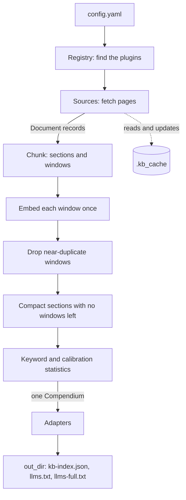

<!--
This file is part of Extractium™
docs/data-flow.md
Author(s): Gabriel Mongefranco
Created: 2026-09-08
Last Modified: 2026-09-09
Summary: What happens to content between the site it is read from and the
files a build writes: the stages, the shape of the data at each one, the
units and time zones every field uses, and the two places where content
that was never published could otherwise reach a published file.
Notes: See README file for documentation and full license information.

Copyright © 2026 The Regents of the University of Michigan

Licensed under the GNU Free Documentation License v1.3 or later.
See <https://www.gnu.org/licenses/fdl-1.3.html>. See README for full license information.

-->

# Extractium™

## Data Flow

[← Back to README](../README.md)

## Summary

This page follows one piece of text from the page it lives on to the file a reader searches. It says what each stage does, what the data looks like when it leaves that stage, and where the checks are that keep private content out of a published file. Read it if you maintain the engine, if you are writing a plugin, or if you have to explain to a reviewer what this tool does with an organization's content.

For the design behind these stages, read the [specification](extractium-spec.md). For the exact bytes of the output, read the [container format](container-format.md).

## The short version

Content enters through a **source**, becomes a **document**, is cut into **sections** and **windows**, the windows are turned into **vectors** once, and everything is packed into one **compendium** that each **adapter** writes in its own format. Nothing is fetched twice and nothing is embedded twice.

## The stages

The same thing in words, for anyone whose reader does not show the diagram: the settings file names the sources and the outputs. The registry finds the matching plugins. Each source fetches pages, using and updating the cache folder, and hands back document records. The chunker cuts each document into sections and then into smaller windows. Every window is embedded once. Near-identical windows are dropped, and any section left with no windows is removed with them. The keyword and calibration statistics are then built over what survives. That single result, the compendium, goes to each adapter, and each adapter writes it into the output folder in its own format.

## What the data looks like at each stage

### 1. A page on a website

A source visits a URL. The web source asks its site handlers which one reads that kind of page; the handler returns the page title, the part of the page that holds the content, and any category hierarchy the page shows, such as a portal's breadcrumb trail.

Every request carries the User-Agent from your settings, and every site's `robots.txt` is checked first. A site whose `robots.txt` cannot be read at all is skipped entirely, not crawled anyway. A page that refuses the crawler outright is reported and skipped, unless you have set `respect_robots_txt: false`, which also allows one retry as a browser for such a page. See the [configuration reference](configuration.md).

### 2. A document

| Field | Meaning |
|---|---|
| `url` | Where it came from. For a local file, `local:` and the path relative to the source folder, so an absolute path from someone's disk never leaves the machine. |
| `title` | The page title. |
| `content` | The content node, or plain text. |
| `source_type` | `kb`, `github`, `web`, `youtube`, or `local`. |
| `source_label` | The name a reader sees for the source this came from, such as `Peer-to-Peer Program`. Taken from the `label` every source gives itself in the settings file. Two sources of the same `source_type` are told apart by this and nothing else. |
| `content_type` | `article`, `readme`, `wiki`, `release_notes`, `page`, `text`, or `video_transcript`. |
| `categories` | The hierarchy from the source, outermost first. Empty when there is none. |
| `local` | True when it was read from a folder on this machine. |

One page is indexed once, however many sources reached it. Two sources can cover overlapping ground without meaning to: a website and a section of it, a portal and a short link into one of its articles. The first source to produce a page keeps it, the later ones are told they were too late, and the build says how many pages that happened to. Pages are compared by their address in normalised form, so two addresses differing only by a trailing slash or a fragment count as one page.

### 3. Sections and windows

The chunker cuts the content at its second- and third-level headings. Each piece is a **section**: at most 1,200 characters, with any longer run split into several sections that share a heading. A section is what a search returns and what an answer cites.

Each section is then cut into **windows** of at most 350 characters, overlapping by about 53, so a fact sitting at a boundary still lands whole inside at least one window. A window is what gets searched.

Every section gets a **stable identifier**: the first 16 hexadecimal characters of a SHA-1 over its page URL, its heading, and its position among sections on that page with the same heading. Rebuild the index tomorrow and an unchanged section keeps its identifier.

Every window records where it sits inside its section. Those offsets are counted in UTF-16 code units, not characters, because browsers read this file first and JavaScript strings are indexed that way. The two counts differ only for characters outside the Basic Multilingual Plane, such as emoji.

### 4. Vectors

Each window is embedded once, with `BAAI/bge-small-en-v1.5`, into 384 numbers. The text that is embedded is the section heading, a newline, then the window.

The model was trained for asymmetric search: a **query** is prefixed with `Represent this sentence for searching relevant passages: ` and an indexed **passage** is not. That prefix is written into every output, because a client that checks only the model name would not notice a changed prefix, and the wrong prefix quietly makes every result worse instead of failing.

Vectors are stored as whole numbers between -127 and 127. A reader divides by 127 to get back a number near the original. `--float32-vecs` skips that step at four times the size.

### 5. Collapse and compaction

Windows that are near-identical to one already kept are dropped, which is what removes the same footer repeated on 400 pages. A section whose every window was dropped is removed too, so nothing is left that a search can never return.

Two windows from the **same page** are never collapsed into each other. The point of this step is to remove boilerplate that many pages share; two passages of one article are not that, however alike they look. The comparison sees the section heading followed by the passage, so without this rule an article with a long title would have every passage sharing a long identical prefix, and real content would be thrown away as duplication. A page's own repetitions are kept, which costs a handful of windows in a corpus.

### 6. Statistics

Two sets of numbers are built over what survives, in this order:

- **Keyword statistics** (BM25): how often each word appears in each window and in how many windows. Words are runs of three or more letters or digits, lowercased. A search must split a query the same way or nothing matches.
- **Calibration**: the mean and standard deviation of how similar a sample of windows are to their nearest neighbour. A client uses these to decide what counts as a good match in this particular corpus, instead of a threshold hand-tuned per site.

The keyword statistics must be built after the collapse, because they refer to windows by position in the final list.

### 7. The compendium

One record holding the sections, the window columns, the vectors, how the vectors were made, the keyword statistics, and the calibration figures, plus the index name and the build time. The build time is UTC, ISO 8601, ending in `Z`, always. Every adapter serializes this record and nothing else.

### 8. The output folder

See [Running a Build](usage.md) for what each file is. Adapters never fetch a URL and never run the model; if one did, the promise of one crawl and one embedding pass would be gone.

## Where private content could reach a published file

Two places, and both have a check.

### Content from a local folder

A folder on your machine can hold things that were never meant to be published. So:

- Every section from a local source is marked `local`, and its URL is `local:` plus a path relative to the source folder. An absolute path never reaches an output.
- **Every output drops local sections unless that output asks for them** with `include_local: true`. Dropping them also drops their windows, their vectors, and their share of the keyword and calibration statistics, so nothing left behind points at content that is gone.
- When an output does include local content, the build's summary says so by name, so nobody publishes such a file without having been told.

The safe default is the one that cannot leak by being forgotten.

### Protected health information

Every build checks the text its sources produced for the shapes identifiers usually take, and writes two reports for a person to read before publishing. The `phi_lint` setting decides the scope: `local` (the default) covers content read from a folder, `all` covers every document, and `'off'` covers nothing.

- The reports go to the folder you ran the build from, **never to the output folder**, so a scheduled build cannot publish them by accident.
- `phi-lint-report.json` is for a program. `phi-lint-report.txt` is for a person.
- Neither report copies the text it matched. It names the file and the line number, so you open the file and look. Copying the value would make the report a second copy of the identifiers.
- The check reads shapes, not meaning. It will miss things, and it will flag things that are fine. It never states that content is free of protected health information, because a pattern check cannot establish that.

So: assume any folder you point a local source at may hold protected health information, read the report, and have a person review what a build produced before publishing it. Nothing on this page is a compliance claim. See [the compliance page](compliance.md) for what the check covers and what it does not, and [the specification](extractium-spec.md), section 7.

## Time zones, units, and encodings

| Thing | Rule |
|---|---|
| Build time | UTC, ISO 8601, with a `Z` suffix. Never a local time. |
| Window offsets | UTF-16 code units, counted from the start of the section's text. |
| Section length | At most 1,200 characters. Windows: at most 350, overlapping by 53. |
| Text encoding | UTF-8 everywhere, in every file this tool writes. |
| Vector storage | Whole numbers from -127 to 127, little-endian, divided by 127 on the way back. Or 32-bit floats, little-endian, with `--float32-vecs`. |
| Keyword tokens | Lowercase runs of three or more ASCII letters or digits. |

## The cache

Fetched pages and their validators are kept in `.kb_cache` so a rebuild only downloads what changed. It holds page bodies, a `meta.json` of validators and content hashes, and a `github/` folder of file bodies read through the GitHub API. Add it to your `.gitignore`. Deleting it costs a slower next build and nothing else.

Each file read from GitHub is stored under its blob name, which is Git's own name for those exact bytes. The same file is therefore downloaded once however many branches or paths point at it, and however it arrived: a repository is normally read as one archive in memory, and the files taken out of it are stored the same way as files requested one at a time. A rebuild of a repository nobody has changed downloads nothing. Nothing in that folder holds an access token: only the file body is written, never a request header.

Note that the cache holds page bodies as fetched. If you crawl a site that requires a login, the cache holds whatever that login gave you. Extractium sends no credentials of its own, apart from a `GITHUB_TOKEN` you set in the environment, which is sent to GitHub and to nowhere else.

## Conclusion

You can now follow any piece of text from the site it lives on to the file that ships, and you know which two stages decide whether private content can reach a published file. Next, read [Running a Build](usage.md) to produce one, or the [container format](container-format.md) to read one back.

## Additional Resources

* [Extractium™ README](../README.md) — project overview and quick start.
* [Running a build](usage.md) — the command, its options, and what it writes.
* [Container format](container-format.md) — the output file, byte by byte.
* [Extractium™ specification](extractium-spec.md) — the design behind these stages.
* [Architecture and Current State](architecture.md) — which modules do which stage today.
* [Configuration reference](configuration.md) — every setting that changes this flow.
* [BAAI bge-small-en-v1.5 model card](https://huggingface.co/BAAI/bge-small-en-v1.5) — the embedding model and its query instruction.

[← Back to README](../README.md)

----

Copyright © 2026 The Regents of the University of Michigan
