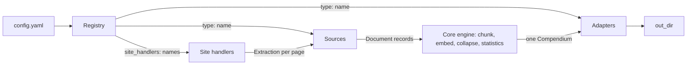
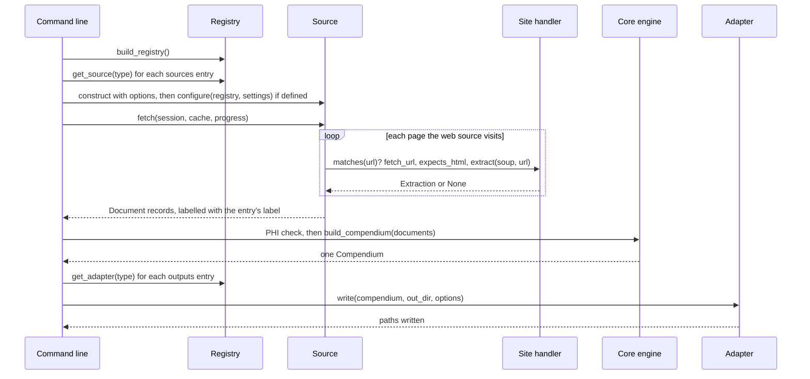

<!--
This file is part of Extractium™
docs/plugin-architecture.md
Author(s): Gabriel Mongefranco
Created: 2026-09-12
Last Modified: 2026-09-12
Summary: The three plugin kinds, the registry's resolution order, the
three protocols with every member and every optional hook, how a source,
a site handler, and an adapter each fit into a build, and a minimal
working example of each kind. Written for a plugin author who has read
nothing else.
Notes: See README file for documentation and full license information.

Copyright © 2026 The Regents of the University of Michigan

Licensed under the GNU Free Documentation License v1.3 or later.
See <https://www.gnu.org/licenses/fdl-1.3.html>. See README for full license information.

-->

# Extractium™

## Plugin Architecture

[← Back to README](../README.md)


## Summary

Extractium reads content through sources, reads web pages through site handlers, and writes outputs through adapters. All three are plugins, and you can add your own by dropping one Python file into a folder. This page explains the three kinds, how the tool finds them, what each one must provide, and where each one acts during a build. It ends with a minimal working example of each kind, checked by the test suite. It is written for a developer who wants to add a source, a handler, or an output and has read nothing else about the project.


## The three kinds

| Kind | Produces | Acts | Built-in examples |
|---|---|---|---|
| **Source** | `Document` records | Once per entry in the settings file's `sources:` list, at the start of a build | `web`, `local`, `okf`, `github_api`, `dspace`, `youtube` |
| **Site handler** | An `Extraction` from a fetched page | Once per URL the `web` source visits, for the first handler that recognizes the URL | `generic`, `tdx`, `github`, `youtube` |
| **Adapter** | Files under the output folder | Once per entry in the `outputs:` list, at the end of a build | `container`, `llmstxt`, `sqlite`, `okf` |

Everything between the sources and the adapters is the core engine and is not pluggable: chunking, embedding, the near-duplicate collapse, the keyword and calibration statistics, and the build step that turns every document into one `Compendium`. A plugin never fetches inside an adapter and never embeds inside a source. That rule is what keeps a build to one crawl and one embedding pass, whatever the outputs.



In words: the settings file names sources and outputs by their registry names, and optionally names which site handlers a web crawl uses. The registry resolves each name to a class. Each source yields document records; the web source asks the site handlers how to read each page it fetches. The core engine turns every document into one compendium. Each adapter writes that compendium into the output folder in its own format.


## How the registry finds a plugin

The registry resolves each name in three tiers, and the first tier that answers wins:

1. **The `plugins/` folder** next to your settings file. Every `.py` file whose name does not start with an underscore is imported, in name order, and its `register(registry)` function is called.
2. **Installed packages** that declare an entry point in one of three groups: `extractium.sources`, `extractium.site_handlers`, or `extractium.adapters`.
3. **The built-ins**, which are declared through those same entry-point groups in the Extractium package itself. A built-in is a plugin that happens to ship in the box.

A plugin in a higher tier shadows a built-in of the same name, so you can replace the `generic` handler for one project by registering your own under that name. Two plugins of the same name in the same tier are an error, reported when they load.

A plugin is checked against its kind's protocol when it is registered, so a missing method is reported at load time rather than in the middle of a build. An entry point from an installed package is loaded on first use, so one broken package cannot stop a build that never asked for it.

Importing a file from `plugins/` runs code you placed there. It has the same trust level as the settings file, and it is documented rather than sandboxed. Review anything you copy into that folder.


## What each kind must provide

The protocols live in `extractium/core/models.py`. A plugin is an ordinary class; it does not inherit from anything. The class is checked for the attributes and methods below.

### Source

| Member | Required | Meaning |
|---|---|---|
| `name` | Yes | Class attribute. The registry key and the `type:` value in `sources:`. |
| `__init__(options)` | Yes | Receives the validated options of its entry. For a built-in type the loader checks the option names; for a plugin type every option is passed through for the plugin to check. `label` is not among them; the build sets it on every document afterwards. |
| `fetch(session, cache, progress)` | Yes | Yields `Document` records. `session` is the HTTP session to request through, `cache` is the fetch cache, and `progress` is a callable that takes one line of text. A source never constructs a session and never prints. |
| `configure(registry, settings)` | No | Called after construction with the plugin registry and the build's global crawl settings, for a source that takes part in a web crawl. A source that needs neither omits it. |
| `read_found_links(session, cache, progress, links)` | No | Called once every source has run, with the addresses the site handlers collected during the crawls and held back. Yields documents like `fetch`. The video source uses it to read linked videos a named channel published. |

A `Document` carries `url`, `title`, `content` (a parsed HTML node or plain text), `source_type`, `content_type`, `categories`, and `local`. Two of those fields are controlled vocabularies, checked when the record is made. `source_type` is one of `kb`, `github`, `web`, `youtube`, `local`, or `repository`. `content_type` is one of `article`, `readme`, `wiki`, `release_notes`, `page`, `text`, `video_transcript`, `manifest`, `repo_map`, `code_file`, or `code_symbol`. A plugin picks the closest fit; `web` and `page` suit most new sources. A document from a folder on the operator's machine sets `local=True` and a URL starting `local:`, and every adapter then drops it unless the output opted in.

### Site handler

| Member | Required | Meaning |
|---|---|---|
| `name` | Yes | Class attribute. The registry key and the value used in `site_handlers:`. |
| `source_type` | Yes | Class attribute. Recorded on every section this handler reads. |
| `default_crawl_exclude_patterns`, `default_index_exclude_patterns` | Yes | Class attributes. Regular expressions added to the crawl's two exclude lists while this handler is enabled, so switching a handler off also drops its exclusions. Empty tuples are fine. |
| `matches(url)` | Yes | True when this handler reads the page at that URL. Handlers are asked in registration order, and `generic` is always last. |
| `fetch_url(url)` | Yes | The URL to actually request, for a host that serves a raw version of a page at another address. Usually the URL unchanged. |
| `expects_html(url)` | Yes | True when the response is HTML to parse; False when it is plain text to wrap. Decided per URL because one host can serve both. |
| `extract(soup, url)` | Yes | Returns an `Extraction`, or `None` when the page is only a hop whose links should be followed and whose content is not indexed. |
| `content_type(url)` | Yes | The `content_type` value recorded on sections read from that URL. |
| `scope_prefix(seed_url)` | No | May narrow the default crawl scope for a seed on a host the handler knows, returning the prefix the crawl stays inside, or `None`. Consulted only when the source has no include patterns. The TeamDynamix handler keeps a crawl inside its portal folder this way. |
| `observe_link(url)` | No | Sees every link the crawl discovers, in scope or not, before the scope check, and returns nothing. The YouTube handler collects linked videos this way, and exposes them through a `found_links()` method the command line reads. |
| `configure(settings)` | No | Receives the build's global crawl settings after construction, for a handler whose rules depend on what the operator configured. |
| `allows(url)` | No | May veto a URL the crawl would otherwise follow. Every handler that defines it is asked about every URL, whatever `matches` says, and one refusal keeps the URL out of scope. The GitHub handler uses it to keep a crawl to the accounts the operator named. |
| `offer_source(seed_url)` | No | May name a better source for a crawl's seed, as a tuple of the source name and its options. Consulted for the seed only, never for a link found mid-crawl. The GitHub and YouTube handlers use it to hand a seed to the source that reads that host properly. |

An `Extraction` carries `title`, `node` (the content node to chunk, or plain text), and `categories` (the page's hierarchy, outermost first). A handler reads a page; it never discovers links. Link discovery stays in the web source, so the crawl is one graph however many handlers are enabled.

### Adapter

| Member | Required | Meaning |
|---|---|---|
| `name` | Yes | Class attribute. The registry key and the `type:` value in `outputs:`. |
| `write(compendium, out_dir, options)` | Yes | Writes files under `out_dir` and returns the paths it wrote, so the command line can list them. `options` holds the entry's options; `include_local` is the one every output accepts. |

An adapter is constructed with no arguments. Two helpers in `extractium/adapters/base.py` do the two things every adapter must: `output_compendium(compendium, options)` returns the compendium with local sections removed unless the output opted in, rebuilding the statistics to match, and `prepare_out_dir(out_dir)` creates the folder and returns it as a path. Start every `write` with those two calls. An adapter never fetches a URL and never runs a model.

A `Compendium` holds `parents` (the sections, each with `t` for its heading, `x` for its text, `u` for its page address, and `source_label` for the name of its source), `children` (the search windows as column arrays), `vectors`, and the keyword and calibration statistics. The [container format](container-format.md) page describes every field.


## Where each kind acts in a build



In words, the command line builds the registry, then walks the `sources:` list. For each entry it asks the registry for the class, constructs it with the entry's options, calls `configure` when the class defines it, and iterates `fetch`. While the web source runs, it asks the site handlers about each URL it visits, and shows every discovered link to the handlers that observe links. Once every source has run, the links the handlers held back are offered to each source that defines `read_found_links`. Every document is stamped with its entry's label. The documents are checked for likely protected health information, then handed to the build step, which returns one compendium. The command line then walks the `outputs:` list, constructs each adapter, and calls `write`, collecting the paths for the summary.

Two rules follow from this order. A source cannot see another source's documents, so cross-source rules, such as indexing a page once however many sources reach it, live in the build step. And an adapter sees the finished compendium and nothing earlier, so an output format cannot depend on where a section came from beyond the fields every section carries.


## A minimal working example of each kind

The three files below are complete. Drop any of them into a `plugins/` folder beside your settings file and the registry finds it on the next build. The test suite extracts these three blocks from this page, loads them through the registry, and exercises each one, so they are known to work against the current code.

### A source

This source reads questions and answers from a JSON file and yields one document per entry. The file is a list of objects with `question`, `answer`, and `url` keys.

```python
# plugins/faq_source.py
"""A source that reads questions and answers from a JSON file."""

import json
import pathlib

from extractium.core.models import Document


class FaqSource:
    """Yields one document per entry of a JSON list of questions and answers."""

    name = "faq"

    def __init__(self, options):
        self.path = pathlib.Path(options["path"])

    def fetch(self, session, cache, progress):
        entries = json.loads(self.path.read_text(encoding="utf-8"))
        for entry in entries:
            progress(f"  read: {entry['url']}")
            yield Document(
                url=entry["url"],
                title=entry["question"],
                content=entry["answer"],
                source_type="web",
                content_type="page",
            )


def register(registry):
    registry.register_source(FaqSource)
```

The settings entry that uses it:

```yaml
sources:
  - type: faq
    label: Frequently Asked Questions
    path: ./faq.json
```

The reference implementation for a source is `extractium/sources/local.py`, which is short, reads files rather than the network, and shows the `local` marking a folder source must apply. `extractium/sources/okf.py` is a second short one that reads files with front matter.

### A site handler

This handler reads pages on one documentation host. It takes the `<main>` element as the content, the first heading inside it as the title, and a breadcrumb trail as the categories. It also adds one exclusion of its own, for the site's search pages.

```python
# plugins/example_docs_handler.py
"""A site handler for pages on docs.example.edu."""

from urllib.parse import urlparse

from extractium.core.models import Extraction


class ExampleDocsHandler:
    """Reads the main element of a page on one documentation host."""

    name = "example_docs"
    source_type = "web"
    default_crawl_exclude_patterns = (r"/search[/?]",)
    default_index_exclude_patterns = (r"/tags/",)

    def matches(self, url):
        return urlparse(url).hostname == "docs.example.edu"

    def fetch_url(self, url):
        return url

    def expects_html(self, url):
        return True

    def extract(self, soup, url):
        main = soup.find("main")
        if main is None:
            return None
        heading = main.find("h1")
        title = heading.get_text(" ", strip=True) if heading is not None else url
        crumbs = tuple(a.get_text(" ", strip=True) for a in soup.select("nav.breadcrumb a"))
        return Extraction(title=title, node=main, categories=crumbs)

    def content_type(self, url):
        return "page"


def register(registry):
    registry.register_site_handler(ExampleDocsHandler)
```

Nothing in the settings file needs to change: every installed handler takes part in a web crawl unless the source's `site_handlers` list names the ones it wants. The reference implementation is `extractium/sources/generic.py`, the handler every crawl falls back to, and `extractium/sources/github.py` shows all three optional hooks in use.

### An adapter

This adapter writes one text file listing every page in the compendium, title and address, one per line.

```python
# plugins/titles_adapter.py
"""An adapter that writes every page's title and address to one text file."""

from extractium.adapters.base import output_compendium, page_address, page_title, prepare_out_dir


class TitlesAdapter:
    """Writes titles.txt: one line per page, the title then the address."""

    name = "titles"

    def write(self, compendium, out_dir, options):
        allowed = output_compendium(compendium, options)
        folder = prepare_out_dir(out_dir)
        pages = {}
        for parent in allowed.parents:
            pages.setdefault(page_address(parent), page_title(parent.t))
        path = folder / "titles.txt"
        lines = [f"{title}\t{address}\n" for address, title in pages.items()]
        path.write_text("".join(lines), encoding="utf-8")
        return (path,)


def register(registry):
    registry.register_adapter(TitlesAdapter)
```

The settings entry that uses it:

```yaml
outputs:
  - type: titles
```

The two helpers imported beside the guardrail, `page_address` and `page_title`, return a section's page address without its section anchor and the page's title without the section heading, so several sections of one page collapse to one line. The reference implementation is `extractium/adapters/llmstxt.py`, which writes two text files from the same records.


## Publishing a plugin as a package

A plugin that several projects share can be installed rather than copied. Declare it in the package's `pyproject.toml` under the matching entry-point group, with the registry name on the left and the class on the right:

```toml
[project.entry-points."extractium.sources"]
faq = "example_plugins.faq_source:FaqSource"
```

Once the package is installed, the registry finds the class by its entry point, in the installed tier, with no `register` function needed. Extractium's own built-ins are declared the same way in its `pyproject.toml`, which is the place to look for the exact spelling of each group.

A plugin kept in a git repository installs the same way, pinned to a commit so a later change cannot arrive unannounced:

```
pip install "git+https://github.com/example-org/extractium-plugin-faq@<commit>"
```

There is no loader for git addresses inside Extractium and none is planned. Installing through pip keeps the trust decision where it already lives: the operator chooses what to install, pip verifies what it fetched, and the lock file can pin it like any other dependency.


## Conclusion

You can now tell which kind of plugin a task needs, write one from the matching example, drop it into `plugins/`, and know where it acts during a build. Next, read [data flow](data-flow.md) for what happens to a document after a source yields it, or the [specification](extractium-spec.md), sections 2 and 3, for the design the protocols serve.


## Additional Resources

* [Extractium™ README](../README.md) — project overview and quick start.
* [Extractium™ specification](extractium-spec.md) — sections 2 and 3: the plugin kinds, the registry, and the data model as designed.
* [Architecture and Current State](architecture.md) — which module holds each built-in plugin.
* [Data flow](data-flow.md) — what happens to a document between a source and an adapter.
* [Container format](container-format.md) — every field a `Compendium` holds, as an adapter sees them.
* [Configuration reference](configuration.md) — how `type:` and `site_handlers:` name a plugin, and what the loader checks.
* [extractium/core/models.py](../extractium/core/models.py) — the three protocols and the record types.
* [extractium/core/registry.py](../extractium/core/registry.py) — the tiers, the plugin folder loader, and the entry-point loader.
* [extractium/adapters/base.py](../extractium/adapters/base.py) — the helpers every adapter shares.
* [Python packaging: entry points](https://packaging.python.org/en/latest/specifications/entry-points/) — how an installed package declares a plugin.


[← Back to README](../README.md)

----

Copyright © 2026 The Regents of the University of Michigan
