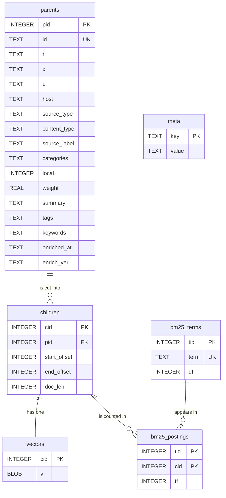

<!--
This file is part of Extractium™
docs/sqlite-database.md
Author(s): Gabriel Mongefranco
Created: 2026-09-17
Last Modified: 2026-09-17
Summary: The tables of the SQLite output: a diagram of how they join,
every column and what it holds, the rows of the meta table, and sample
queries for listing pages, finding a word, and reading code analysis.
Notes: See README file for documentation and full license information.

Copyright © 2026 The Regents of the University of Michigan

Licensed under the GNU Free Documentation License v1.3 or later.
See <https://www.gnu.org/licenses/fdl-1.3.html>. See README for full license information.

-->

# Extractium™

## The SQLite Database

[← Back to README](../README.md)


## Summary

The `sqlite` output writes a compendium, the collection one build produces, as a SQLite database you can query with SQL. This page shows the tables, how they join, what every column holds, and a few queries to start from. It is for anyone who wants to report on what was indexed, read the code analysis of a GitHub source, or load the content into a hosted database such as Cloudflare D1.


## What the file holds

The file is named `<slug>.sqlite`, so `compendium.sqlite` unless you set a `slug`. Add it to a build with `- type: sqlite` under `outputs`. See the [configuration reference](configuration.md).

It holds everything the build read: the text of every section, the search windows, the vectors, and the keyword statistics. It also holds the code analysis of a GitHub source. The container files and the `llms.txt` files leave code out, because they are read inside a language model's context window. This file and the `okf` folder are where code analysis is published.

The file holds the text of your pages, not a description of them. Decide whether to publish it the same way you decide for the container. Content from a `local` source is left out unless the output says `include_local: true`.


## The tables



The diagram in words: there are six tables.

- `parents` holds one row per section of text. A section is what a search result cites.
- `children` holds one row per search window. A window is a slice of one section's text. `children.pid` points at `parents.pid`, and one section has one or more windows.
- `vectors` holds one row per window. `vectors.cid` points at `children.cid`, and every window has exactly one vector.
- `bm25_terms` holds one row per distinct word in the compendium.
- `bm25_postings` holds one row for each pair of a word and a window the word appears in. `bm25_postings.tid` points at `bm25_terms.tid`, and `bm25_postings.cid` points at `children.cid`.
- `meta` holds one row per fact about the build. It joins to nothing.


## The columns

### `parents`: one row per section

| Column | What it holds |
|---|---|
| `pid` | The section's position in the build, counted from zero. The other tables refer to a section by this number. It can change from one build to the next. |
| `id` | A stable identifier of sixteen hexadecimal digits. It stays the same across builds while the page address and the heading stay the same. |
| `t` | The heading: the page title, then ` -- `, then the section heading when the section has one. |
| `x` | The text of the section. |
| `u` | The address the section was read from. |
| `host` | The host name in `u`, in lower case. |
| `source_type` | The kind of source: `web`, `github`, `youtube`, `dspace`, `local`, `okf`, or a plug-in's own name. |
| `content_type` | What the record is: a page, a video transcript, a deposit, and so on. The four code records are `manifest`, `repo_map`, `code_file`, and `code_symbol`. |
| `source_label` | The `label` you gave the source in the settings file. |
| `categories` | A JSON array of text: the categories the source filed the page under, widest first. |
| `local` | `1` when the section came from a `local` source, else `0`. |
| `weight` | A number the search multiplies a result's score by. `1.0` unless a source set another. |
| `summary` | The page's own description, when the source gave one. `NULL` otherwise. |
| `tags` | A JSON array of text: the page's tags. `NULL` when there are none. |
| `keywords` | A JSON array of text: the keywords found in this section. `NULL` when the keyword step did not run. |
| `enriched_at` | When the keyword step named the section, in UTC, as ISO 8601 text ending in `Z`. `NULL` otherwise. |
| `enrich_ver` | The version of the keyword step that named it. `NULL` otherwise. |

### `children`: one row per search window

| Column | What it holds |
|---|---|
| `cid` | The window's position in the build, counted from zero. |
| `pid` | The section the window was cut from. |
| `start_offset`, `end_offset` | Where the window starts and ends inside the section's `x`. The unit is UTF-16 code units, which is how JavaScript counts characters. For text without emoji or other rare characters, that is the same as counting characters. |
| `doc_len` | How many words the window holds, as the keyword search counts them. |

### `vectors`: one row per search window

| Column | What it holds |
|---|---|
| `cid` | The window the vector belongs to. |
| `v` | The vector, as raw little-endian bytes. The `meta` rows `embedding.dtype` and `embedding.dims` say how to read them: `int8` is one byte per number, `float32` is four. |

### `bm25_terms` and `bm25_postings`: the keyword statistics

| Column | What it holds |
|---|---|
| `bm25_terms.tid` | The word's number. It is the word's position in sorted order, counted from zero. |
| `bm25_terms.term` | The word, in lower case. Each word is stored once. |
| `bm25_terms.df` | How many windows the word appears in. |
| `bm25_postings.tid` | The word, by its number. |
| `bm25_postings.cid` | The window. |
| `bm25_postings.tf` | How many times the word appears in that window. |

The postings table has no row numbers of its own. It is stored in `(tid, cid)` order, so all the rows for one word sit together and the table needs no separate index.

### `meta`: one row per fact about the build

Every value is text. Convert the numbers you need.

| Key | What it holds |
|---|---|
| `_license` | The license notice of the file. |
| `format`, `v` | The format name, `extractium-compendium`, and the container layout version the content matches. |
| `extractium` | The version of Extractium™ that wrote the file. |
| `builtAt` | When the build ran, in UTC, as ISO 8601 text ending in `Z`. |
| `site` | The display name of the compendium. |
| `sourceCount` | How many distinct addresses contributed a section. |
| `offsetUnit` | The unit of the window offsets, `utf16`. |
| `sqlite.schema` | The layout of these tables. It is `2`. A file without this row was written by an earlier version, which stored the word's text in every posting. |
| `embedding.model`, `embedding.browserModel`, `embedding.dims`, `embedding.normalized`, `embedding.queryPrefix`, `embedding.passagePrefix`, `embedding.dtype`, `embedding.scale` | How the vectors were made. A program that searches by meaning has to embed the query the same way. `embedding.scale` is present only for `int8` vectors. |
| `bm25.k`, `bm25.b`, `bm25.d`, `bm25.avgDocLen` | The settings and the average window length the keyword ranking uses. |
| `calibration.mean`, `calibration.std`, `calibration.sampleSize` | How similar the windows are to each other. No client thresholds on these. |
| `calibration.unrelatedMedian`, `calibration.unrelatedSpread`, `calibration.unrelatedProbes` | What an unrelated question scores in this compendium. A search sets its relevance floor at the median plus one and a half spreads. Absent from a file written before these existed. |


## Sample queries

Open the file with the `sqlite3` command-line program, with any SQLite viewer, or from a script. These examples use a made-up compendium for `example.org`.

```bash
sqlite3 dist/compendium.sqlite
```

### How many pages and sections each source gave

```sql
-- Grain: one row per source.
SELECT
    source_label,
    COUNT(DISTINCT u) AS pages,     -- one address is one page
    COUNT(*)          AS sections
FROM parents
GROUP BY source_label
ORDER BY pages DESC
;
```

### The sections that use a word

This is a plain keyword lookup. It joins a word to its windows, and each window to its section. A section with several matching windows is listed once, with the counts added up.

```sql
-- Grain: one row per section that contains the word.
SELECT
    p.t          AS heading,
    p.u          AS address,
    SUM(bp.tf)   AS times_used
FROM bm25_terms AS bt
INNER JOIN bm25_postings AS bp
    ON bp.tid = bt.tid              -- 1:many; one word has many postings
INNER JOIN children AS c
    ON c.cid = bp.cid               -- many:1; each posting names one window
INNER JOIN parents AS p
    ON p.pid = c.pid                -- many:1; each window belongs to one section
WHERE bt.term = 'sleep'             -- words are stored in lower case
GROUP BY p.pid, p.t, p.u
ORDER BY times_used DESC
LIMIT 20
;
```

### The functions and classes found in one repository

Code analysis is in this file and in the `okf` folder only. A `code_symbol` row is one function, class, or method. Its heading names the file and the definition.

```sql
-- Grain: one row per definition found in the repository.
SELECT
    t AS definition,
    u AS address
FROM parents
WHERE content_type = 'code_symbol'
  AND u LIKE 'https://github.com/example-org/example-tool/%'
ORDER BY u, t
;
```

### The most common keywords of one source

`keywords` is a JSON array, so SQLite's `json_each` turns it into rows.

```sql
-- Grain: one row per keyword.
SELECT
    k.value  AS keyword,
    COUNT(*) AS sections
FROM parents AS p,
     json_each(p.keywords) AS k     -- one row per keyword of each section; a NULL list gives none
WHERE p.source_label = 'Main Site'
GROUP BY k.value
ORDER BY sections DESC
LIMIT 25
;
```

### The text of one search window

SQLite's `substr` counts characters and starts at one. The offsets count UTF-16 code units and start at zero. For text without emoji or other rare characters the two agree, and this query returns the window exactly.

```sql
-- Grain: one row, the window numbered 0.
SELECT substr(p.x, c.start_offset + 1, c.end_offset - c.start_offset) AS window_text
FROM children AS c
INNER JOIN parents AS p
    ON p.pid = c.pid                -- many:1; each window belongs to one section
WHERE c.cid = 0
;
```


## Loading the file somewhere else

The Cloudflare example loads this file into a D1 database and searches it there. Its export script and its search code both read the `sqlite.schema` row first and stop when the layout is not the one they know. Do the same in a program of your own that reads the keyword tables by column name. See [how to deploy a remote MCP server](how-to/deploy-a-remote-mcp-server.md).


## Conclusion

You can now find any table and column in the SQLite output, join the tables safely, and start from a working query. For the same content as one binary file, see the container format. For the settings that write this file, see the configuration reference.


## Additional Resources

* [Configuration reference](configuration.md): the `sqlite` output and the `slug` setting.
* [Container format](container-format.md): the same fields as the search clients read them.
* [How to deploy a remote MCP server](how-to/deploy-a-remote-mcp-server.md): loading the file into Cloudflare D1.
* [GitHub repository indexing](github-repository-indexing.md): what the code records hold.
* [SQLite JSON functions](https://www.sqlite.org/json1.html): `json_each`, used in the keywords query.
* [SQLite command-line program](https://www.sqlite.org/cli.html): opening the file and running a query.

[← Back to README](../README.md)
